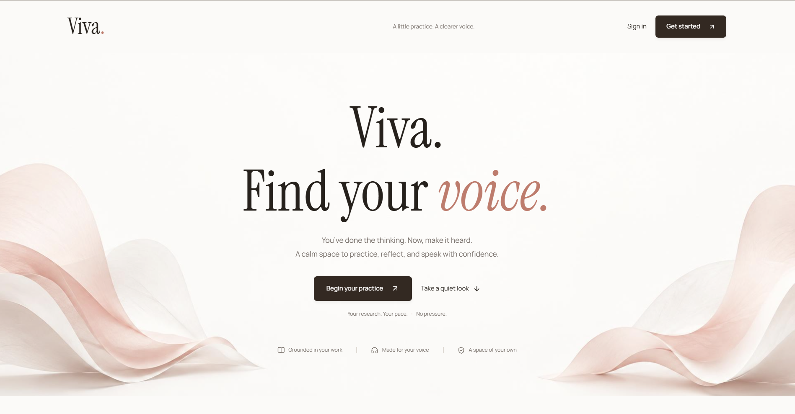

#Viva booth

STARK hackathon: students practise a thesis defence or class talk out loud.

Read first, then listen. They paste the paper (title, research question, abstract, up to five references). We look those citations up on Scholarxiv before the mic. They talk (Voxide). We check the talk against their text and against abstracts we actually fetched. We coach how to say it. Viva questions come from hits we pulled, not invented papers. Host on EthioDeploy. No payments.

We do not decide scientific “truth.” We decide: said vs their manuscript, named source exists, claim vs that abstract. Missing API hit = unverified.

Open talk: no paste. Citations come from speech only, then the same Scholarxiv check.

Not a ChatGPT tab. Not a search-only paper chatbot. Not a TED “energy” scorer. Not a full-PDF factory.